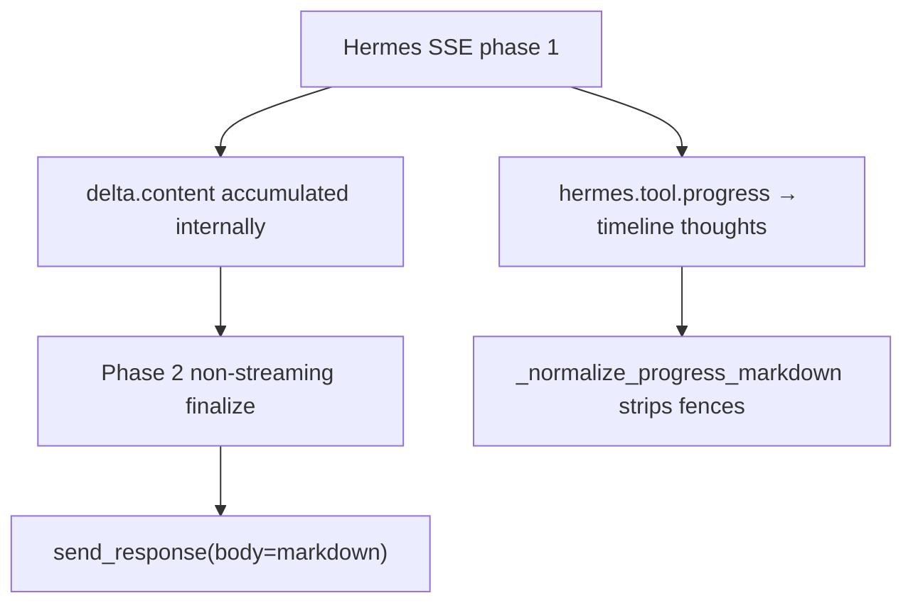

# PLY-43: Cursor-style code diff rendering in Linear UI

**Status:** Investigation complete — **superseded by PR linking** (see branch `cursor/link-prs-linear-diffs-f5fe`)

> **Correction (2026-06-24):** The original report focused on markdown `diff` blocks in agent chat. That was the wrong surface. Linear's native diff UI is **[Linear Diffs](https://linear.app/docs/diffs)** — it renders GitHub PRs, not pasted patches. Hermes should **open a PR and link it** on the agent session via `externalUrls`; Linear handles the rest.

**Status (original):** Investigation complete  
**Date:** 2026-06-24  
**Decision:** Use **summary + short `diff` excerpts** for code changes; keep **Cursor citations** for existing-code references. Avoid raw full patches and plain code blocks for diffs.

---

## Executive summary

Cursor-style *inline PR diff review* (split view, file tree, guided hunks) is **not** available inside Linear agent `response` markdown. Linear’s native **Diffs** product is a separate surface tied to GitHub PRs, not agent comment bodies.

For Hermes agent replies, **markdown fenced `diff` blocks with a prose summary** are viable and readable. They are not as rich as Cursor’s diff UI, but they work well for small, focused changes when combined with the existing two-phase response flow (non-streaming final answer).

| Question | Answer |
|----------|--------|
| Does Linear render fenced diff/code blocks well enough? | **Yes** for small excerpts; code blocks support language tags and preserve formatting. |
| Are unified diffs displayed with preserved formatting? | **Yes** in `response` / issue comments — monospace, scrollable blocks. `+`/`-` coloring depends on `diff` language tag (expected: green/red, same as GitHub). |
| Syntax highlighting for diffs? | **Partial** — `diff`/`patch` tags get +/- highlighting; not full intra-line or side-by-side like Cursor or Linear Diffs. |
| Practical size limits? | Soft limits: ~2k tokens phase-2 `max_tokens`; coding path truncates at 3000 chars. Recommend **≤25 lines per excerpt**, **≤3 excerpts per reply**. |
| Easy to scan for non-trivial changes? | **Only with summary + excerpt**; raw multi-file patches are hard to scan. |
| Best fallback if native rendering is weak? | Summary bullets + Cursor citations + link to PR in `externalUrls`. |

---

## Hermes → Linear output path (relevant constraints)



Key implications:

1. **Final answers only** — Diffs belong in the `response` activity `body`, not in timeline `thought` activities (markdown is stripped there).
2. **No streaming fragmentation** — Phase 2 uses `stream: False`; fenced blocks arrive intact. Formatting survives incremental output concerns.
3. **No server-side diff post-processing** — Whatever the LLM emits is sent verbatim via `send_response()`.
4. **Prompt-driven today** — `HERMES_REPLY_STYLE` already requests Cursor citations; diff guidance should be added there (see Follow-up).

References:

```84:95:linear_agent.py
HERMES_REPLY_STYLE = """
Reply style (Linear issue comment — user already saw tool progress on the timeline):
...
- Reference code with citation fences: ```startLine:endLine:filepath (Cursor/Linear format).
...
""".strip()
```

```671:675:linear_agent.py
    async def send_response(self, session_id: str, body: str) -> bool:
        """Emit the final 'response' activity."""
        result = await self.create_activity(
            session_id, ActivityType.response, body=body,
        )
```

---

## Linear UI capabilities (documented + inferred)

### What Linear supports in markdown

From [Linear Editor docs](https://linear.app/docs/editor):

- Fenced code blocks via `/code` or triple backticks
- Language-tagged blocks (standard markdown info string)
- Mermaid diagrams (`/diagram`)
- Collapsible sections, tables, headings, lists
- Agent activity `body` fields: **Markdown supported** ([DEVELOPING_AGENT_INTERACTION.md](../DEVELOPING_AGENT_INTERACTION.md))

### What Linear Diffs is (and is not)

[Linear Diffs changelog](https://linear.app/changelog/2026-05-27-linear-diffs) describes a **native PR review surface**: unified/split layout, structural highlighting, guided reviews, agent iteration from the diff view. This requires a linked GitHub PR and upgraded GitHub integration — **not** inline agent markdown.

**Conclusion:** Hermes cannot replicate Cursor/Linear-Diffs PR UI inside a comment. Inline fenced diffs are the realistic option.

### Diff syntax highlighting (expected behavior)

Industry-standard markdown renderers (GitHub, Prism, highlight.js, Lexical diff plugin) treat:

```markdown
```diff
- removed line
+ added line
  context line
```
```

…with red deletions and green additions. Linear does not document `diff` explicitly, but:

- Code blocks accept arbitrary language identifiers
- Pasting `git diff` output is a common pattern (GitHub, Outline, Braide docs all support `diff`)
- No evidence Linear strips `+`/`-` prefixes

**Risk:** `startLine:endLine:filepath` citation fences may render as a plain code block with a non-standard language string — fine for references, not for diffs.

---

## Formats tested

Six fixture payloads live in [`docs/fixtures/ply-43-diff-formats/`](fixtures/ply-43-diff-formats/). Local preview: open [`preview.html`](fixtures/ply-43-diff-formats/preview.html) in a browser (Prism.js diff highlighting).

| # | Format | Scannability | Highlighting | When to use |
|---|--------|--------------|--------------|-------------|
| A | ` ```diff ` unified excerpt | Good | +/- colors | Single hunk, ≤25 lines |
| B | ` ```patch ` | Good | Same as diff (renderer-dependent) | Alias if model prefers `patch` |
| C | Plain ` ``` ` | Poor | None | Avoid for diffs |
| D | ` ```start:end:path ` citation | Good for context | Syntax by path extension (weak) | Existing code reference, not changes |
| E | **Summary + diff hybrid** | **Best** | +/- on excerpt | **Default for Hermes** |
| F | Truncated large diff + PR note | Good | +/- on excerpt only | Multi-file or large changes |

### Rendering notes (local verification)

Run:

```bash
python3 scripts/ply-43_render_diff_formats.py
```

Pygments confirms `diff` and `patch` lexers color `+`/`-` lines; plain text lexer does not.

### Surfaces compared

| Surface | Markdown fences | Diff highlighting | Notes |
|---------|-----------------|-------------------|-------|
| Agent `response` | Yes | Expected yes with `diff` tag | Primary Hermes output |
| Issue comments | Yes | Expected yes | Same editor |
| Agent `thought` timeline | Stripped | N/A | Do not put diffs here |
| Project updates | Yes | Expected yes | Same editor; not used by Hermes today |
| Linear Diffs (PR UI) | N/A | Full PR experience | Requires linked PR |

### Streaming

Not applicable to final diffs: phase-2 finalize is non-streaming (`stream: False`, `max_tokens: 2000`). Timeline progress never includes LLM draft text.

---

## Recommended Hermes output format

### Primary: Summary + diff excerpt (Format E)

Structure every code-change reply as:

1. **Finding / decision** (1–2 sentences)
2. **What changed** (short bullets, file names in backticks)
3. **Diff excerpt** per touched file (≤25 lines, ` ```diff ` fence)
4. **PR link** when change is large (`externalUrls` on the session)

Example payload (ready to emit via `send_response`):

```markdown
## Finding

Empty investigation drafts were still sent through phase-2 rewrite.

## Change

Added an early return in `_finalize_response` when `draft_text` is blank.

**`linear_agent.py`:**

```diff
@@ -2476,6 +2476,9 @@ class TaskProcessor:
     async def _finalize_response(self, session_id, draft_text, ...):
+        if not draft_text.strip():
+            return
+
         if tracker and tracker.tool_progress:
             finalized = await self._call_llm_finalize(...)
```
```

### Secondary: Cursor citations (Format D)

Keep for **pointing at code**, not for showing edits:

```markdown
The guard lives here:

```2476:2482:linear_agent.py
    async def _finalize_response(self, session_id, draft_text, ...):
        if not draft_text.strip():
            return
```
```

### Avoid

- Full `git diff` output for multi-file changes
- Plain untagged code blocks with manual `+` prefixes
- Diffs in timeline `thought` activities
- Relying on Linear Diffs UI without a linked PR

---

## Clear decision

| Option | Verdict |
|--------|---------|
| Use raw diff output | **No** — only for tiny single-hunk changes |
| Use summarized changes plus diff excerpt | **Yes — recommended default** |
| Avoid inline diffs in Linear UI | **No** — inline excerpts are viable with constraints |

**Cursor-style diff presentation is partially viable in Linear:** prose + fenced `diff` excerpts are readable; full Cursor/Linear-Diffs PR experience is not.

---

## Follow-up implementation (PLY-44+)

| Priority | Work item | Location |
|----------|-----------|----------|
| P0 | Add diff output rules to `HERMES_REPLY_STYLE` | `linear_agent.py` |
| P1 | Manual QA: post fixture payloads to a test Linear issue via agent session | Linear workspace |
| P2 | Optional `truncate_diff_blocks(body, max_lines=25)` post-processor | `linear_agent.py` |
| P3 | Citation fence validator/normalizer | new `formatting/` module |
| P4 | pytest fixtures from `docs/fixtures/ply-43-diff-formats/` | `tests/` |

### Suggested `HERMES_REPLY_STYLE` addition

```
- For code changes: lead with a one-sentence finding, then a short ```diff excerpt (≤25 lines, one hunk per file).
- Use ```startLine:endLine:filepath citations for referencing existing code, not for +/- hunks.
- For large or multi-file changes: summarize in bullets and link the PR; do not paste full git diff output.
```

---

## Acceptance criteria checklist

- [x] Know whether Cursor-style diff presentation is viable in Linear — **partially; excerpt + summary yes, full PR diff UI no**
- [x] At least 2–3 tested rendering formats — **six fixtures + local Prism/Pygments preview**
- [x] One recommended format chosen — **summary + `diff` excerpt**
- [x] Follow-up implementation identified — **see table above**

---

## Artifacts

| Artifact | Path |
|----------|------|
| Investigation report | `docs/PLY-43-linear-diff-rendering-investigation.md` |
| Example payloads | `docs/fixtures/ply-43-diff-formats/*.md` |
| Browser preview | `docs/fixtures/ply-43-diff-formats/preview.html` |
| Terminal render script | `scripts/ply-43_render_diff_formats.py` |

**Screenshot note:** Live Linear UI screenshots were not captured in this environment (no Linear API credentials). Use the HTML preview for +/- coloring reference; post Format E to a test issue for final visual confirmation.
