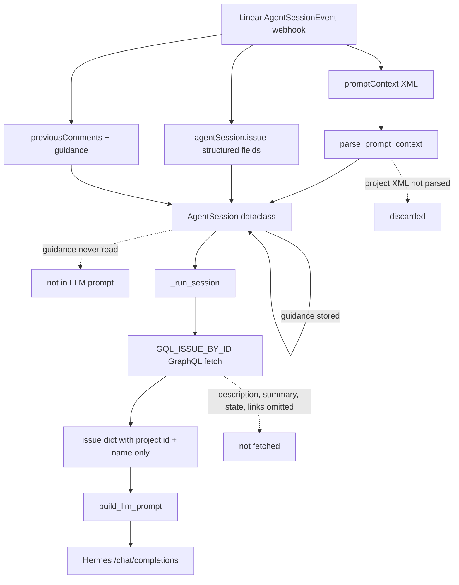

# PLY-78: Project context injected into the Linear agent

**Status:** done  
**Date:** 2026-06-28  
**Issue:** [PLY-78](https://linear.app) — Determine how much project context is injected into the Linear agent

## Executive summary

**The agent receives only a subset of project data — the project name — not the full project content.**

Linear's webhook `promptContext` XML can include a project name and summary, but Hermes does not parse or forward that XML block. Instead, the agent re-fetches the issue via GraphQL and injects `project.name` only. Project description, summary, state, links, milestones, and documents are **not** included in the LLM prompt unless the agent discovers them at runtime via tools (e.g. `list_projects()` or shell/GraphQL calls using `$LINEAR_API_KEY`).

---

## Data flow



---

## What Linear provides

### 1. `promptContext` (top-level webhook string)

Linear documents this as formatted XML with issue details, comments, guidance, and project info. Example from [Developing the Agent Interaction](https://linear.app/developers/agent-interaction):

```xml
<project name="Checkout flow">Faster checkout process</project>
```

The `name` attribute is the project title; the **text content** inside the tag is the project **summary**.

Hermes stores the raw string on `AgentSession.prompt_context` but **never passes it to the LLM**. `parse_prompt_context()` extracts:

| Field | Extracted? |
|-------|------------|
| `identifier` | Yes |
| `title` | Yes |
| `description` | Yes (issue only) |
| `team_name` | Yes |
| `labels` | Yes |
| `guidance` | Yes (rule text only) |
| `primary_directive` | Yes |
| `comment_count` | Yes |
| **`<project>` name** | **No** |
| **`<project>` summary (inner text)** | **No** |
| `parent-issue` | No |
| Comment thread bodies | No (handled separately) |

### 2. Structured webhook fields

From `_handle_agent_session()`:

| Source | Used for |
|--------|----------|
| `agentSession.issue` | `issue_id`, `identifier`, `title`, `description`, `team`, `state`, `priority` |
| `agentSession.comment` | User @mention body (created events) |
| `agentActivity.body` | Follow-up user message (prompted events) |
| `previousComments` | Stored on session; **comments are re-fetched** via GraphQL in `_handle_analysis` |
| `guidance` (top-level) | Parsed from XML into `session.guidance` — **stored but not injected into prompts** |

The webhook `agentSession.issue` object does **not** include nested project description in our handler; project data comes from the later GraphQL fetch.

---

## What Hermes fetches (GraphQL)

### Issue query (`GQL_ISSUE_BY_ID`)

```graphql
project { id name }
```

Only **project id and name** are requested. No `description`, `summary`, `state`, `content`, `url`, `lead`, `members`, or `documents`.

### Projects query (`GQL_PROJECTS`) — on-demand only

Used by `LinearClient.list_projects()` / `find_project_by_name()` when the **agent explicitly calls** those APIs during tool use:

```graphql
id, name, description, url, teams { ... }
```

This is **not** called automatically when handling an issue.

---

## What reaches the LLM prompt

`TaskProcessor.build_llm_prompt()` assembles the Hermes user message. Project-related content:

| Session type | Project in prompt |
|--------------|-------------------|
| `created` (first @mention / delegation) | `Project: {name}` or `Project: (none)` |
| `prompted` (follow-up) | Same single line |

**Not included anywhere in the prompt:**

- Project description / summary / state
- Project links or documents
- Raw `promptContext` XML
- Parsed `session.guidance` rules
- `session.prompt_context`

### Other context that *is* injected (for completeness)

| Block | Source | Notes |
|-------|--------|-------|
| Issue identifier, title, status, team, labels | GraphQL issue + session | Full issue `description` on `created` only |
| Comment thread | GraphQL `issue.comments` (recursive) | Full bodies, chronological |
| Prior session activity | GraphQL session activities | `prompted` sessions only |
| Hermes skills list | `GET /v1/skills` | Name + truncated description |
| Session plan steps | LLM plan call | 3–5 checklist labels |
| Work/reply style | Constants | `HERMES_WORK_STYLE`, `HERMES_REPLY_STYLE` |

The plan-generation call (`_build_plan_prompt`) also omits project context — only issue identifier, title, truncated description (800 chars), skills, and user request.

---

## Concrete example (PLY-78 issue)

The issue is attached to project **"Hermes as Linear agent"**, which in Linear has a long markdown description (architecture, deploy commands, repo link, status checklist). What Hermes sees in the LLM prompt:

```
Project: Hermes as Linear agent
```

Nothing from the project description block (Architecture, Key capabilities, Deploy, Repo, etc.) is injected automatically.

---

## Gaps and implications

1. **Project summary in `promptContext` is lost** — Linear embeds it in `<project name="…">summary text</project>` but we neither parse it nor forward the raw XML.
2. **GraphQL under-fetches project** — Even the authoritative API path only retrieves `id` and `name`.
3. **Guidance rules are parsed but unused** — Workspace/team-level instructions from `promptContext` are stored on `AgentSession.guidance` and never appended to `build_llm_prompt()`.
4. **Agent can still learn project details at runtime** — Via `$LINEAR_API_KEY`, Hermes can call Linear GraphQL or use `list_projects()` if it chooses to investigate; that is opportunistic, not guaranteed context.

---

## Recommendations (out of scope for this investigation)

If full project context is desired:

1. Extend `GQL_ISSUE_BY_ID` to `project { id name description summary state { name } url }` (fields available per Linear schema).
2. Parse `<project>` from `promptContext` as a fallback when GraphQL project is null.
3. Append `session.guidance` to the prompt as a "Team/workspace guidance" block.
4. Optionally inject a truncated project description (e.g. first 2–4k chars) in `build_llm_prompt()`.

---

## Verification

Automated checks: `tests/test_project_context.py`

```bash
python -m pytest tests/test_project_context.py -v
```

Key assertions:

- `parse_prompt_context` ignores `<project>` tags
- `build_llm_prompt` contains project name only, not description/summary
- `session.guidance` is not reflected in the assembled prompt

## Code references

| Concern | Location |
|---------|----------|
| Issue GraphQL project fields | `linear_agent.py` — `GQL_ISSUE_BY_ID` |
| promptContext parser | `linear_agent.py` — `parse_prompt_context()` |
| LLM prompt assembly | `linear_agent.py` — `build_llm_prompt()` |
| Webhook → session | `linear_agent.py` — `_handle_agent_session()` |
| On-demand project list | `linear_agent.py` — `GQL_PROJECTS`, `list_projects()` |
