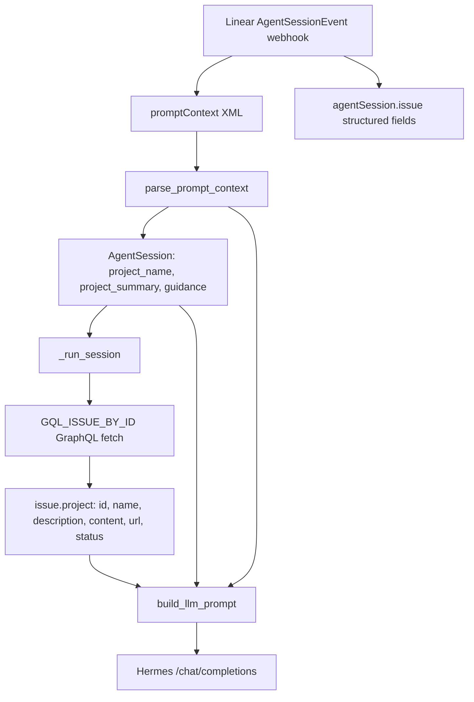

# PLY-78: Project context injected into the Linear agent

**Status:** done  
**Date:** 2026-06-28  
**Issue:** [PLY-78](https://linear.app) — Determine how much project context is injected into the Linear agent

## Executive summary

**The agent receives rich project context in LLM prompts:** name, status, URL, summary (`description`), and overview (`content`, truncated to 4k chars). Workspace/team **guidance** rules from `promptContext` are also injected. When GraphQL returns no project, `promptContext` `<project>` name and summary are used as fallback.

---

## Data flow



---

## What Linear provides

### 1. `promptContext` (top-level webhook string)

Linear documents this as formatted XML with issue details, comments, guidance, and project info:

```xml
<project name="Checkout flow">Faster checkout process</project>
```

Hermes parses project name and summary from this XML and stores them on `AgentSession` as fallback when GraphQL project data is missing. The raw XML is **not** forwarded to the LLM.

`parse_prompt_context()` extracts:

| Field | Extracted? |
|-------|------------|
| `identifier` | Yes |
| `title` | Yes |
| `description` | Yes (issue only) |
| `team_name` | Yes |
| `labels` | Yes |
| `guidance` | Yes (rule text only) |
| `project_name` | Yes |
| `project_summary` | Yes (inner text of `<project>`) |
| `primary_directive` | Yes |
| `comment_count` | Yes |
| `parent-issue` | No |
| Comment thread bodies | No (handled separately via GraphQL) |

### 2. Structured webhook fields

From `_handle_agent_session()`:

| Source | Used for |
|--------|----------|
| `agentSession.issue` | `issue_id`, `identifier`, `title`, `description`, `team`, `state`, `priority` |
| `agentSession.comment` | User @mention body (created events) |
| `agentActivity.body` | Follow-up user message (prompted events) |
| `previousComments` | Stored on session; **comments are re-fetched** via GraphQL in `_handle_analysis` |
| `guidance` (in promptContext XML) | Parsed into `session.guidance` → **injected into LLM prompt** |

---

## What Hermes fetches (GraphQL)

### Issue query (`GQL_ISSUE_BY_ID`)

```graphql
project {
  id
  name
  description
  content
  url
  status { name type }
}
```

- `description` — short project summary
- `content` — full markdown project overview
- `status` — lifecycle state (e.g. `started`, `completed`)

### Projects query (`GQL_PROJECTS`) — on-demand only

Still used by `LinearClient.list_projects()` when the agent explicitly calls it during tool use — not part of automatic session injection.

---

## What reaches the LLM prompt

`TaskProcessor.build_llm_prompt()` injects a **project context block**:

```
Project: Hermes as Linear agent
Project status: In Progress (started)
Project URL: https://linear.app/...
Project summary: @-mention @Hermes on any issue...
Project overview:
## Architecture
...
```

Plus, when present:

```
Team/workspace guidance:
- Always follow coding standards
```

| Session type | Project + guidance in prompt |
|--------------|------------------------------|
| `created` (first @mention / delegation) | Full project block + guidance + issue description |
| `prompted` (follow-up) | Full project block + guidance (no issue description repeat) |

**Truncation:** `content` is capped at `PROJECT_CONTEXT_MAX_LEN` (4000 chars) with `…(truncated)` suffix.

**Not included:** Raw `promptContext` XML, project documents/milestones/members (unless agent fetches via tools).

### Context-before-action (infrastructure / SSH tasks)

Hermes is explicitly guided to **read before acting**:

1. **Execution environment block** — states the agent host hostname and default working directory; clarifies that shell tools run there unless the agent explicitly SSHs elsewhere.
2. **Prompt ordering** — project overview, sibling issues, guidance, and the full comment thread appear **before** the user request and plan checklist.
3. **Sibling project issues** — when the issue has a project, Hermes fetches up to 8 recently updated issues in that project (title, status, description excerpt) so VPS/host context from prior work is visible even on a new issue.
4. **Work style rules** — require identifying target host from thread/project text before PAM, SSH, firewall, or package changes.
5. **Session plan** — planning prompt and fallback checklist start with "Review project context", "Read issue thread", "Confirm target host" before tool work.

**Operational tip:** Document default SSH targets (hostname, alias, environment) in the **project overview** or a dedicated infra issue in the same project — sibling-issue injection picks that up automatically.

### Other context that *is* injected

| Block | Source | Notes |
|-------|--------|-------|
| Issue identifier, title, status, team, labels | GraphQL issue + session | Full issue `description` on `created` only |
| Comment thread | GraphQL `issue.comments` (recursive) | Full bodies, chronological |
| Prior session activity | GraphQL session activities | `prompted` sessions only |
| Hermes skills list | `GET /v1/skills` | Name + truncated description |
| Session plan steps | LLM plan call | 3–5 checklist labels |

---

## Concrete example (PLY-78 issue)

For project **"Hermes as Linear agent"**, Hermes now receives the project name, status, URL, summary, and the full markdown overview (architecture, deploy commands, repo link, etc.) up to 4k characters — plus any team guidance rules from `promptContext`.

---

## Verification

Automated checks: `tests/test_project_context.py`

```bash
LINEAR_API_KEY=test LINEAR_WEBHOOK_SECRET=test python3 -m pytest tests/test_project_context.py -v
```

## Code references

| Concern | Location |
|---------|----------|
| Issue GraphQL project fields | `linear_agent.py` — `GQL_ISSUE_BY_ID` |
| promptContext parser | `linear_agent.py` — `parse_prompt_context()` |
| Project/guidance formatters | `linear_agent.py` — `format_project_context_block()`, `format_guidance_block()` |
| LLM prompt assembly | `linear_agent.py` — `build_llm_prompt()` |
| Webhook → session | `linear_agent.py` — `_handle_agent_session()` |
