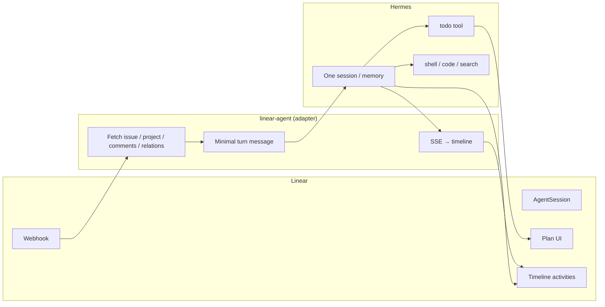

# Linear agent architecture and session learnings

**Status:** current as of 2026-06-30  
**Audience:** operators, future agent work, architecture review  
**Related PRs:** #17 (Hermes-native), #18 (prompted deltas), #19 (finalize/gate/watermarks), #20 (block relations)

---

## Executive summary

We investigated a real Hermes session dump (`untitled-session-fe5e8bde.json`, PLY-112 brainstorming) and found the Linear adapter was **orchestrating a second agent on top of Hermes** — synthetic planning, split session IDs, full comment replay every turn, and wrong user messages on follow-ups. The fix is a **thin adapter** model (like Cursor around one thread): Hermes owns memory, tools, and todos; Linear owns webhooks, issue context, timeline activities, and PR links.

All core fixes are merged to `main`. Production still requires **`HERMES_NATIVE_MODE=1`** in `.env` and a service restart.

---

## Background: what the PLY-112 session exposed

A exported Hermes session (120 messages, ~238K tokens of user-role text) on **PLY-112 — GATE D — Define Watcher Parameters** showed:

| Symptom | Root cause |
|---------|------------|
| 22 prompted turns used the **gate issue description** as `User message:` | `user_request` fell back to `issue.description` when webhook body was empty |
| Prompt size grew 6KB → **65KB** (truncated) | Every follow-up re-injected the **entire** comment thread |
| 7× finalize passes | Phase-2 rewrite ran on every turn with tool progress |
| Single Hermes session ID (good) | Native mode was on for this run |
| SSH to correct VPS `129.212.177.112` | PLY-78 context-first + sibling issues worked |
| `delegate_task` on a human gate | No lightweight profile for gate issues |

The session artifact was removed from the repo; `untitled-session-*.json` is gitignored.

---

## Target architecture: thin adapter

### Hermes owns

- Session memory and tool history
- Native `todo` planning
- Investigation, execution, draft text
- Skills / SOUL on the agent host

### Linear adapter owns

- Webhook routing, dedup, stop signal
- Issue/project/comments/guidance/**relations** fetch
- `todo` → Linear Plan projection (`GET /api/todos/{session_id}`)
- Tool progress → timeline activities
- Final `response` activity + GitHub PR links for Diffs
- Workflow state nudges (In Progress / In Review)

See also: [hermes-native-mode.md](./hermes-native-mode.md), [PLY-78-project-context-injection.md](./PLY-78-project-context-injection.md).

---

## Session model

### Legacy mode (`HERMES_NATIVE_MODE=0`, default off)

Three Hermes session IDs per Linear turn:

| Phase | `X-Hermes-Session-Id` |
|-------|------------------------|
| Synthetic plan | `{linear_session_id}:plan` |
| Main work | `{linear_session_id}` |
| Finalize rewrite | `{linear_session_id}:finalize` |

Hermes memory does **not** carry across these suffix sessions. Planning is duplicated (JSON pre-flight + Hermes `todo`). `plan.advance()` runs on **every** tool progress event, desyncing the Linear checklist.

### Native mode (`HERMES_NATIVE_MODE=1`, recommended)

| Rule | Behavior |
|------|----------|
| Session ID | **One** ID per Linear `AgentSession` (the Linear UUID) |
| Planning | Hermes `todo` only → `GET /api/todos/{id}` → Linear Plan |
| No todos | No Linear plan (correct) |
| Finalize | Optional phase-2 rewrite in the **same** session (skipped on `prompted` turns) |

---

## Prompting

### Created turn (first assignment)

Full context:

- Issue identifier, title, status, team, labels
- Project name, status, URL, summary, overview (`content`, truncated 4k)
- Sibling project issues (recent titles/descriptions)
- Team/workspace guidance from `promptContext`
- Full comment thread (chronological)
- **Issue relations** (blocked by, blocks, related, duplicate)
- User request (comment or description)
- Short Linear output rules; context-before-action hints

Omits in native mode: agent identity walls, skills catalog, execution-environment boilerplate, synthetic plan checklist.

### Prompted turn (follow-up in agent thread)

**Delta only** — Hermes session retains prior work:

- Follow-up header + issue status
- **Actual user message** (never issue description on gate templates)
- **New comments only** since last turn (conversation watermark)
- Relations block + blocker warning if still blocked
- Linear output rules

### User message resolution (`resolve_user_request`)

Priority on `prompted`:

1. Webhook `agentActivity.body`, then `agentSession.comment.body`
2. Latest **human** comment since watermark
3. Latest human comment in thread
4. Never the issue **description** (gate templates are not the user's new message)

On `created`: comment body → description → fallback.

### Conversation watermarks

Stored at `~/.linear-agent/conversation_watermarks.json` (survives agent restart). After each turn, the adapter records the latest comment position; follow-ups inject only newer comments.

Threaded comment children that duplicate parent bodies are deduplicated.

---

## Planning

| Mode | Linear plan source |
|------|-------------------|
| Native | Hermes `todo` tool → `/api/todos/{session_id}` → `agentSessionUpdate(plan: …)` |
| Legacy | `_call_llm_plan()` JSON pre-flight, or 4-step fallback checklist |

Native mode does **not** call `plan.advance()` on unrelated tool events. Plan syncs on `todo` progress (`running` / `completed`) and after turn completion.

---

## Issue workflow states

The adapter nudges Linear workflow states; it does **not** set Done/Completed.

| Event | State change |
|-------|----------------|
| Agent starts (not already started/done/canceled) | → **In Progress** |
| First turn completes (`created`, not gate, not blocked deferral) | → **In Review** |
| Follow-up turns (`prompted`) | **No** state change |
| Human gate issues (`🚧` + Human Required) | **No** auto In Review |
| Blocked deferral (`created` + open blockers) | **No** work started; stays prior state |

Gate detection is a **lightweight prompt profile** (recommend/decide only; no `delegate_task`, deploy, or PRs) — not a separate product mode.

---

## Blocked-by / blocks relations

GraphQL fetches `relations` and `inverseRelations` on every issue load.

| Relation | Source | Prompt label |
|----------|--------|--------------|
| Blocked by | `inverseRelations` where `type: blocks` → `issue` | `Blocked by:` |
| Blocks | `relations` where `type: blocks` → `relatedIssue` | `Blocks:` |
| Related / Duplicate | either direction | `Related:` / `Duplicate of:` |

### Deferral policy (`LINEAR_DEFER_ON_BLOCKERS=true`, default)

- **`created`** + any blocker not Done/Canceled → post deferral message, **no Hermes run**, no In Progress
- **`prompted`** → proceed (user override) with warning in prompt
- Set `LINEAR_DEFER_ON_BLOCKERS=0` to disable deferral (relations still injected)

---

## Finalize (phase-2 rewrite)

When the main Hermes pass used tools, legacy mode always ran a second LLM call to produce a user-facing summary.

**Current behavior:** finalize runs only on **`created`** turns with tool progress. **Prompted** follow-ups send the investigation draft directly (user already saw tools on the timeline).

---

## Cursor vs Hermes (two different surfaces)

| | **Hermes** (linear-agent) | **Cursor** (cloud agent) |
|--|---------------------------|---------------------------|
| Trigger | Linear AgentSession webhook | GitHub / workspace task |
| Session | One Hermes session per Linear agent session | Cursor chat / cloud agent run |
| Linear state | Can move In Progress / In Review | Does not change Linear states |
| Block relations | Fetched and enforced (defer on created) | Only if you paste/link context |
| Rich issue blocks | Markdown `description` via GraphQL | Whatever you attach to the task |

Cursor does not participate in Linear agent session threads unless you bridge manually.

---

## Configuration reference

| Variable | Default | Purpose |
|----------|---------|---------|
| `HERMES_NATIVE_MODE` | `0` | `1` = thin adapter (strongly recommended) |
| `LINEAR_DEFER_ON_BLOCKERS` | `true` | Defer `created` turns when blocked |
| `HERMES_API_URL` | `http://127.0.0.1:8642/v1` | Hermes API |
| `LINEAR_API_KEY` | — | Injected as `$LINEAR_API_KEY` in prompts |

---

## Deployment checklist

1. Merge is complete on `main` (PRs #17–#20).
2. Set `HERMES_NATIVE_MODE=1` in `.env`.
3. Restart `linear-agent` service.
4. Smoke-test: one implementation issue + one conversational follow-up + one blocked issue.

---

## Test coverage

| File | Covers |
|------|--------|
| `tests/test_hermes_native_mode.py` | Todo mapping, native prompts, settings flag |
| `tests/test_prompted_context.py` | User request resolution, comment deltas, dedupe |
| `tests/test_gate_finalize.py` | Gate detection, skip finalize, watermarks |
| `tests/test_issue_relations.py` | Blockers, deferral, relations in prompts |
| `tests/test_project_context.py` | PLY-78 project/guidance injection |

Run: `python3 -m pytest tests/ -v`

---

## Backlog (not implemented)

- `/v1/runs` migration for structured lifecycle events
- Hermes session ID rotation after context compression
- Slim DiscoveryTracker (thin SSE passthrough)
- Remove legacy `:plan` / `plan.advance()` path after native soak
- Hermes session title from Linear `identifier — title`
- Tighter duplicate-webhook dedup
- Issue **document** / rich editor blocks beyond `description` markdown
- Hermes-side: `execute_code` partial-success marked as error; 65KB message cap

---

## PR timeline

| PR | Summary | Status |
|----|---------|--------|
| #17 | Hermes-native mode (flag-gated) | Merged |
| #18 | Prompted user_request + comment deltas | Merged |
| #19 | Skip finalize on prompted, gate profile, watermark persistence | Merged |
| #20 | Blocked-by relations + deferral | Merged |

---

## Paste-ready Linear status

See [linear-activity-status-2026-06-30.md](./linear-activity-status-2026-06-30.md) for a comment formatted for posting on a Linear issue or agent session thread.
